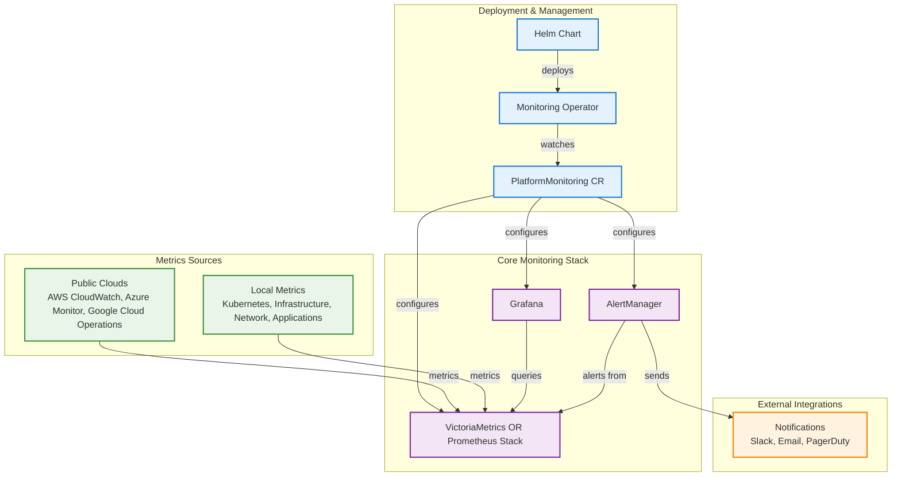

# Qubership Monitoring Operator

[](https://github.com/Netcracker/qubership-monitoring-operator/actions/workflows/build.yaml)
[](https://github.com/Netcracker/qubership-monitoring-operator/actions/workflows/link-checker.yaml)
[](https://github.com/Netcracker/qubership-monitoring-operator/actions/workflows/super-linter.yaml)
[](https://goreportcard.com/report/github.com/Netcracker/qubership-monitoring-operator)
[](LICENSE)

A comprehensive Kubernetes operator that simplifies the deployment and management of production-ready monitoring stacks. Built to handle complex monitoring environments with minimal operational overhead while providing maximum flexibility and scalability.

## What is Qubership Monitoring Operator?

The Qubership Monitoring Operator is a cloud-native solution that automates the deployment and management of complete monitoring infrastructure on Kubernetes. It orchestrates industry-standard monitoring tools and provides a unified interface for comprehensive observability.

### Key Benefits

- **Automated Management**: Deploy and manage complex monitoring stacks with a single custom resource
- **Production Ready**: Battle-tested configurations optimized for enterprise environments
- **Multi-Stack Support**: Choose between VictoriaMetrics or Prometheus based on your needs
- **Resource Efficient**: VictoriaMetrics uses 2-5x less RAM compared to Prometheus
- **Cloud Native**: Seamless integration with AWS, Azure, and Google Cloud platforms
- **Complete Observability**: Metrics collection, visualization, alerting, and autoscaling in one package
- **Zero Downtime**: Rolling updates and high availability configurations out of the box

## What You Get

### Core Components
- **Time Series Database**: VictoriaMetrics or Prometheus for metrics storage
- **Visualization**: Grafana with pre-built dashboards for Kubernetes and applications
- **Alerting**: AlertManager or VMAlert for intelligent alert management
- **Metrics Collection**: Automated discovery and scraping of application metrics
- **Autoscaling**: Horizontal Pod Autoscaler integration with custom metrics

### Included Exporters
- **Infrastructure**: node-exporter, kube-state-metrics for Kubernetes insights
- **Security**: cert-exporter for TLS certificate monitoring
- **Network**: blackbox-exporter for endpoint monitoring and network latency tracking
- **Cloud Platforms**: AWS CloudWatch, Azure Monitor, Google Cloud Operations exporters
- **Custom**: JSON exporter for REST APIs, version exporter for application versioning
- **Events**: cloud-events-exporter for CloudEvents monitoring

### Integrations
- **Graphite**: graphite-remote-adapter for Graphite integration
- **Load Balancing**: promxy for high availability and federation

## Architecture



## Quick Start

### Prerequisites
- Kubernetes 1.19+ cluster
- Helm 3.0+
- kubectl configured for your cluster

### 1. Install the Operator

**Install from source:**
```bash
# Clone the repository
git clone https://github.com/Netcracker/qubership-monitoring-operator.git
cd qubership-monitoring-operator

# Install the operator from local charts
# This will automatically create a PlatformMonitoring resource with default configuration
helm install monitoring-operator charts/qubership-monitoring-operator \
  --namespace monitoring \
  --create-namespace
```

**What gets installed automatically:**
- **Monitoring Operator** - manages monitoring stack lifecycle
- **VictoriaMetrics Operator** - enabled
- **VictoriaMetrics Single** - time series database with 14d retention
- **VictoriaMetrics Agent** - metrics collector
- **VictoriaMetrics Alert** - alerting component
- **VictoriaMetrics AlertManager** - alert manager
- **VictoriaMetrics Auth** - authentication proxy
- **Grafana** - visualization with pre-built dashboards
- **Grafana Operator** - manages Grafana instances
- **kube-state-metrics** - Kubernetes metrics collector
- **node-exporter** - infrastructure metrics collector
- **Common Dashboards** - essential monitoring dashboards
- **Prometheus Rules** - basic alerting rules

**What's disabled by default:**
- All cloud exporters (AWS, Azure, GCP)
- All optional exporters (blackbox, cert, json, etc.)
- Prometheus Adapter for HPA
- Integrations (Graphite, Promxy)

### 2. Verify Installation

```bash
# Check that monitoring operator is running
kubectl get pods -n monitoring -l "app.kubernetes.io/part-of=monitoring"

# Check PlatformMonitoring resource (created automatically by Helm)
kubectl get platformmonitoring -n monitoring

# Wait for all components to be ready
kubectl get pods -n monitoring
```

### 3. Access Your Monitoring

```bash
# Get Grafana admin password
kubectl get secret monitoring-grafana-admin -n monitoring -o jsonpath="{.data.password}" | base64 -d

# Port forward to access Grafana
kubectl port-forward -n monitoring svc/monitoring-grafana 3000:3000

# Open http://localhost:3000 (admin/password from above)
```

## Documentation

### Quick Guides
- **[Installation Guide](https://netcracker.github.io/qubership-monitoring-operator/installation/)** - Detailed installation instructions
- **[Configuration Guide](https://netcracker.github.io/qubership-monitoring-operator/configuration/)** - Complete configuration options
- **[Troubleshooting](https://netcracker.github.io/qubership-monitoring-operator/troubleshooting/)** - Common issues and solutions

### API Reference
- **[PlatformMonitoring](https://netcracker.github.io/qubership-monitoring-operator/api/platform-monitoring/)** - Main custom resource reference
- **[PrometheusAdapter](https://netcracker.github.io/qubership-monitoring-operator/api/prometheus-adapter/)** - HPA metrics adapter configuration

### Default Monitoring
- **[Metrics](https://netcracker.github.io/qubership-monitoring-operator/defaults/metrics/)** - Out-of-the-box metrics collection
- **[Alerts](https://netcracker.github.io/qubership-monitoring-operator/defaults/alerts/)** - Pre-configured alerting rules
- **[Dashboards](https://netcracker.github.io/qubership-monitoring-operator/defaults/dashboards/overall-platform-health/)** - Built-in Grafana dashboards

### Examples
- **[Service Monitoring](https://netcracker.github.io/qubership-monitoring-operator/examples/)** - Monitor your applications
- **[Cloud Watch Integration](https://netcracker.github.io/qubership-monitoring-operator/examples/components/cloudwatch-exporter-config/)** - Cloud provider integrations

### Architecture
- **[Architecture Overview](https://netcracker.github.io/qubership-monitoring-operator/architecture/)** - Detailed system architecture

## Contributing

We welcome contributions! Please see our [Contributing Guide](CONTRIBUTING.md) for details.

### Development Setup

```bash
# Clone the repository
git clone https://github.com/Netcracker/qubership-monitoring-operator.git
cd qubership-monitoring-operator

# Install dependencies
go mod download

# Run tests
make test

# Run locally
make run
```

## License

This project is licensed under the Apache License 2.0 - see the [LICENSE](LICENSE) file for details.

## Support

- **Documentation**: [Full Documentation](https://netcracker.github.io/qubership-monitoring-operator)
- **Issues**: [GitHub Issues](https://github.com/Netcracker/qubership-monitoring-operator/issues)

## Star History

If this project helped you, please consider giving it a star!

---

**Ready to get started?** Follow our [Quick Start guide](#quick-start) and have monitoring running in minutes!
# Trigger rebuild with correct SHA checkout
